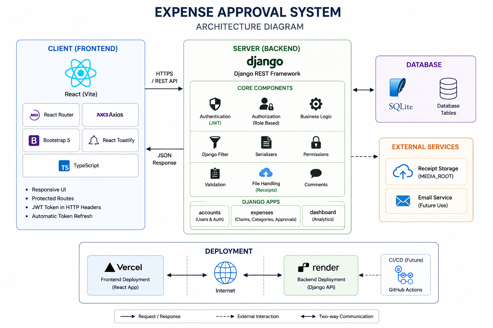
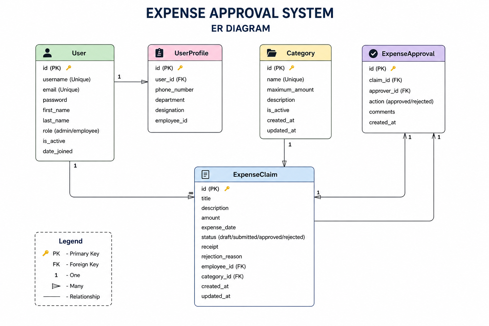
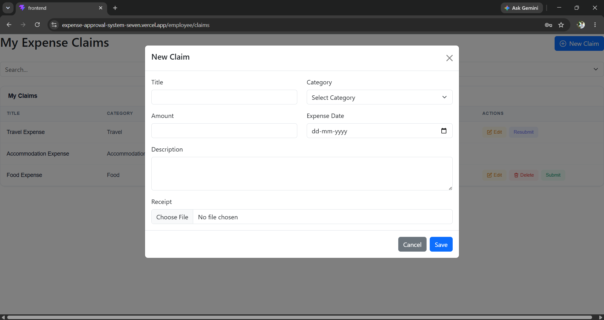

# 💼 Expense Approval System

A full-stack **Expense Approval System** built using **Django REST Framework** and **React (Vite)**.

The application enables employees to submit expense claims while administrators can review, approve, or reject them through a secure role-based workflow.

This project demonstrates:

- JWT Authentication
- Role-Based Authorization
- REST API Development
- Expense Approval Workflow
- CRUD Operations
- Dashboard Analytics
- Search & Filtering
- File Uploads
- Responsive UI
- Full Stack Deployment

---

# 🌐 Live Demo

### Frontend

https://expense-approval-system-seven.vercel.app

### Backend API

https://expense-approval-system-backend.onrender.com

---

# ✨ Features

## 👨‍💼 Employee

- Secure JWT Login
- Employee Dashboard
- Create Expense Claims
- Edit Draft Claims
- Delete Draft Claims
- Submit Claims
- Resubmit Rejected Claims
- Upload Receipt
- Search Claims
- Filter Claims
- View Claim Status
- View Manager Comments

---

## 👨‍💻 Administrator

- Secure JWT Login
- Dashboard Analytics
- Employee Management (CRUD)
- Category Management (CRUD)
- View All Expense Claims
- Approve Claims
- Reject Claims
- Add Manager Comments
- Search Employees
- Search Claims
- Filter Claims

---

# 🏗️ Tech Stack

## Frontend

- React (Vite)
- React Router
- Axios
- Bootstrap 5
- React Toastify

## Backend

- Python
- Django
- Django REST Framework
- Simple JWT
- Django Filter
- Pillow

## Database

- SQLite

## Deployment

- Render (Backend)
- Vercel (Frontend)

---

# 📂 Project Structure

```text
expense-approval-system
│
├── backend
│   ├── accounts
│   ├── dashboard
│   ├── expenses
│   ├── config
│   ├── requirements.txt
│   └── manage.py
│
├── frontend
│   ├── src
│   ├── public
│   ├── package.json
│   └── vite.config.js
│
├── screenshots
│
├── README.md
├── API_DOCUMENTATION.md
└── .gitignore
```

---

# 🏛️ Architecture Overview

The application follows a **Client-Server Architecture**.

The frontend communicates with the backend using REST APIs secured with JWT Authentication.

```
                React + Vite
                      │
                Axios + JWT
                      │
                      ▼
        Django REST Framework API
                      │
        Business Logic & Validation
                      │
                      ▼
               SQLite Database
```

---

# 🏛️ Architecture Diagram



---

# 🗄️ Database ER Diagram



---

# 🔄 Expense Approval Workflow

```text
Employee

Create Claim
      │
      ▼
Draft
      │
Submit
      ▼
Submitted
      │
      ├────────► Approved
      │
      └────────► Rejected
                    │
                    ▼
             Edit Claim
                    │
              Resubmit
```

---

# 🔐 Authentication

The application uses **JWT Authentication**.

Features:

- Secure Login
- JWT Access Token
- Refresh Token
- Protected Routes
- Persistent Login
- Role-Based Authorization

Roles:

- Administrator
- Employee

---

# 📊 Modules

## Authentication

- Login
- Logout
- Token Refresh

## Employee

- Dashboard
- Expense Claims

## Administrator

- Dashboard
- Employees
- Categories
- Expense Claims

# 📡 API Documentation

## Base URL

### Local

```
http://127.0.0.1:8000/api/
```

### Production

```
https://expense-approval-system-backend.onrender.com/api/
```

---

## Authentication APIs

| Method | Endpoint               | Description          |
| ------ | ---------------------- | -------------------- |
| POST   | `/auth/login/`         | Login                |
| POST   | `/auth/token/refresh/` | Refresh Access Token |

---

## Dashboard APIs

| Method | Endpoint               | Description                   |
| ------ | ---------------------- | ----------------------------- |
| GET    | `/dashboard/admin/`    | Admin Dashboard Statistics    |
| GET    | `/dashboard/employee/` | Employee Dashboard Statistics |

---

## Employee APIs

| Method | Endpoint           | Description      |
| ------ | ------------------ | ---------------- |
| GET    | `/employees/`      | List Employees   |
| POST   | `/employees/`      | Create Employee  |
| GET    | `/employees/{id}/` | Employee Details |
| PUT    | `/employees/{id}/` | Update Employee  |
| DELETE | `/employees/{id}/` | Delete Employee  |

---

## Category APIs

| Method | Endpoint            | Description      |
| ------ | ------------------- | ---------------- |
| GET    | `/categories/`      | List Categories  |
| POST   | `/categories/`      | Create Category  |
| GET    | `/categories/{id}/` | Category Details |
| PUT    | `/categories/{id}/` | Update Category  |
| DELETE | `/categories/{id}/` | Delete Category  |

---

## Expense Claim APIs

| Method | Endpoint                | Description   |
| ------ | ----------------------- | ------------- |
| GET    | `/claims/`              | List Claims   |
| POST   | `/claims/`              | Create Claim  |
| GET    | `/claims/{id}/`         | Claim Details |
| PUT    | `/claims/{id}/`         | Update Claim  |
| DELETE | `/claims/{id}/`         | Delete Claim  |
| POST   | `/claims/{id}/submit/`  | Submit Claim  |
| POST   | `/claims/{id}/approve/` | Approve Claim |
| POST   | `/claims/{id}/reject/`  | Reject Claim  |

---

## Authorization Header

All protected endpoints require:

```http
Authorization: Bearer <access_token>
```

---

# ⚙️ Installation

## Clone Repository

```bash
git clone https://github.com/atrihegde/expense-approval-system.git
```

---

# Backend Setup

Move into backend directory

```bash
cd backend
```

Create virtual environment

```bash
python -m venv venv
```

### Activate Virtual Environment

Windows

```bash
venv\Scripts\activate
```

Linux / macOS

```bash
source venv/bin/activate
```

Install dependencies

```bash
pip install -r requirements.txt
```

---

## Create Backend Environment File

Create a `.env` file inside the **backend** folder.

```env
SECRET_KEY=your-secret-key
DEBUG=True
ALLOWED_HOSTS=127.0.0.1,localhost
```

---

## Run Backend

Apply migrations

```bash
python manage.py migrate
```

Create demo users and categories

```bash
python manage.py seed_data
```

Run server

```bash
python manage.py runserver
```

---

# Frontend Setup

Move into frontend directory

```bash
cd frontend
```

Install packages

```bash
npm install
```

Create `.env`

```env
VITE_API_BASE_URL=http://127.0.0.1:8000/api/
```

Run application

```bash
npm run dev
```

---

# 👤 Demo Accounts

| Role          | Username | Password    |
| ------------- | -------- | ----------- |
| Administrator | admin    | admin123    |
| Employee      | employee | employee123 |

---

# 📸 Screenshots

## Login Page


---

## Employee Dashboard


---

## My Claims


---

## Create Claim



---

## Admin Dashboard


---

## Employee Management


---

## Category Management


---

## Claim Approval


# 💡 Design Decisions

The following design decisions were made during development:

- Used **Django REST Framework** to build a clean and scalable REST API.
- Implemented **JWT Authentication** for secure and stateless user authentication.
- Used a **Custom User Model** with role-based authorization (Administrator and Employee).
- Structured the frontend into reusable React components to improve maintainability.
- Organized API calls using a dedicated service layer (Axios).
- Used **SQLite** for simplicity and rapid development.
- Deployed the frontend and backend independently using **Vercel** and **Render**.

---

# 📌 Assumptions

The following assumptions were made while implementing the application:

- Every expense claim belongs to exactly one category.
- Only authenticated users can access protected resources.
- Employees can edit or delete only **Draft** and **Rejected** claims.
- Submitted claims cannot be modified unless rejected.
- Rejected claims require modification before they can be resubmitted.
- Only administrators can approve or reject submitted claims.
- Receipt upload is optional.
- Dashboard statistics update automatically whenever claims are created or updated.

---

# ✅ Validation Rules

The application includes both client-side and server-side validation.

### Employee

- Name is required.
- Email must be unique.
- Password is required.
- Department is required.
- Designation is required.

### Category

- Category Name is required.
- Maximum Amount must be greater than zero.

### Expense Claim

- Title is required.
- Category is required.
- Amount must be greater than zero.
- Expense Date cannot be in the future.
- Description is required.
- Rejection requires manager comments.

---

# 🚀 Deployment

## Frontend

- Hosted on **Vercel**

```
https://expense-approval-system-seven.vercel.app
```

---

## Backend

- Hosted on **Render**

```
https://expense-approval-system-backend.onrender.com
```

---

## Deployment Notes

The backend uses **SQLite** as the database.

Since SQLite storage is not persistent on Render's free web service, the application initializes the database automatically during deployment using:

```bash
python manage.py migrate
python manage.py seed_data
gunicorn config.wsgi:application
```

This creates the required database tables, demo users, and default categories whenever a new instance is provisioned.

---

# 📈 Future Enhancements

Potential improvements include:

- PostgreSQL Database
- Email Notifications
- Password Reset
- Dashboard Charts
- Audit Logs
- Docker Support
- Unit Testing
- GitHub Actions CI/CD
- Export Claims to PDF
- Export Claims to Excel
- Cloud Storage for Receipts
- Profile Management
- Dark Mode
- Advanced Analytics
- Multi-Level Approval Workflow

---

# 🎯 Challenges Faced

During development, the following challenges were encountered:

- Configuring JWT authentication between React and Django.
- Managing role-based routing and authorization.
- Implementing approval and rejection workflow.
- Handling receipt uploads.
- Configuring environment variables for development and production.
- Deploying Django on Render with SQLite.
- Managing demo data initialization for deployed instances.
- Connecting the deployed frontend with the production backend.

These challenges helped improve understanding of full-stack development and deployment practices.

---

# 👨‍💻 Author

**Atri Hegde**

Bachelor of Engineering (Information Science & Engineering)

### Skills

- Python
- Django
- Django REST Framework
- React
- JavaScript
- SQL
- REST APIs
- Git & GitHub

---
