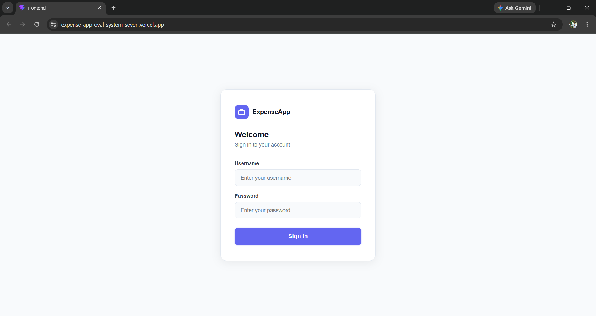
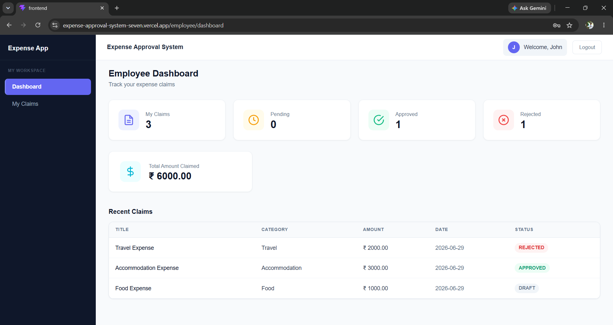
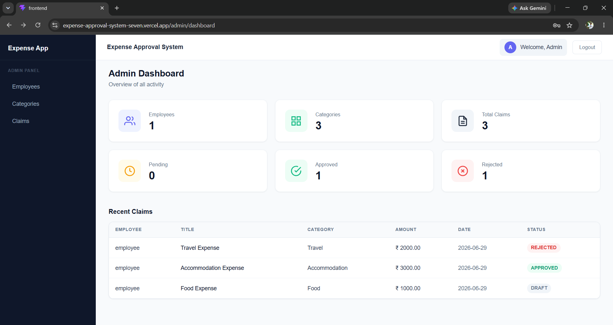
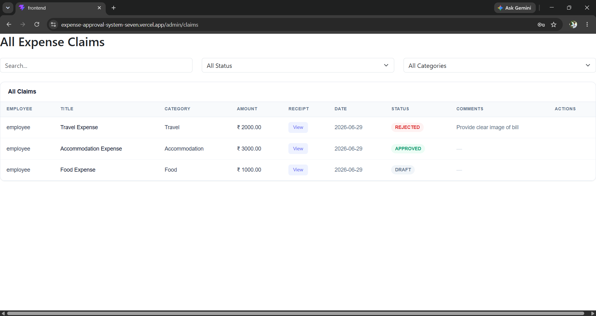
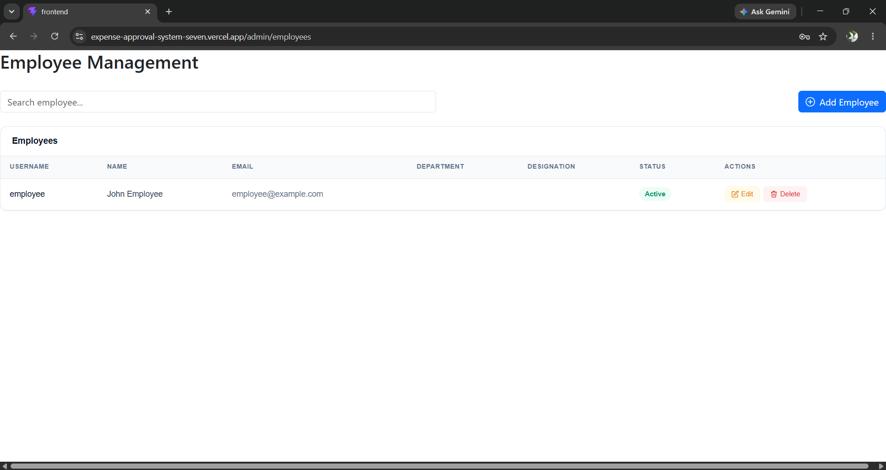
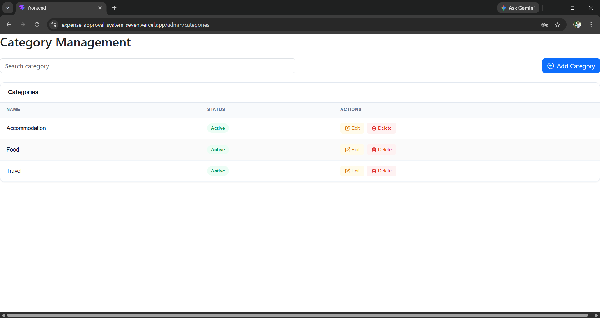

# 💼 Expense Approval System

A full-stack Expense Approval System built using **Django REST Framework** and **React (Vite)**. The application enables employees to submit expense claims and allows administrators to review, approve, or reject them through a secure role-based workflow.

## 🌐 Live Demo

**Frontend:** https://expense-approval-system-seven.vercel.app

**Backend API:** https://expense-approval-system-backend.onrender.com

---

## ✨ Features

### 👨‍💼 Employee

- Secure JWT Login
- Employee Dashboard
- Create Expense Claims
- Edit Draft Claims
- Delete Draft Claims
- Submit Claims
- Resubmit Rejected Claims
- Upload Receipt
- Search & Filter Claims
- View Claim Status

### 👨‍💻 Admin

- Secure JWT Login
- Admin Dashboard
- Employee Management (CRUD)
- Category Management (CRUD)
- View All Claims
- Approve Claims
- Reject Claims with Comments
- Search & Filter Claims

---

## 🏗️ Tech Stack

### Frontend

- React (Vite)
- React Router
- Axios
- Bootstrap 5
- React Toastify

### Backend

- Python
- Django
- Django REST Framework
- Simple JWT Authentication
- Django Filter
- Pillow

### Database

- SQLite

### Deployment

- Render (Backend)
- Vercel (Frontend)

---

## 📂 Project Structure

```
expense-approval-system
│
├── backend
│   ├── accounts
│   ├── dashboard
│   ├── expenses
│   ├── config
│   └── manage.py
│
└── frontend
    ├── src
    ├── public
    └── package.json
```

---

## 🔄 Workflow

```
Employee

Create Claim
      │
      ▼
Draft
      │
Submit
      ▼
Submitted
      │
      ├────────► Approved
      │
      └────────► Rejected
                    │
                    ▼
             Edit Claim
                    │
              Resubmit
```

---

## 🔐 Authentication

- JWT Authentication
- Role-Based Authorization
- Protected Routes
- Automatic Token Refresh

---

## 📊 Modules

### Authentication

- Login
- JWT Token Management

### Employee

- Dashboard
- Expense Claims

### Admin

- Dashboard
- Employees
- Categories
- Claims Approval

---

## 📡 Main API Endpoints

| Method | Endpoint                    | Description   |
| ------ | --------------------------- | ------------- |
| POST   | `/api/auth/login/`          | Login         |
| POST   | `/api/auth/token/refresh/`  | Refresh Token |
| GET    | `/api/dashboard/`           | Dashboard     |
| GET    | `/api/claims/`              | List Claims   |
| POST   | `/api/claims/`              | Create Claim  |
| PUT    | `/api/claims/{id}/`         | Update Claim  |
| DELETE | `/api/claims/{id}/`         | Delete Claim  |
| POST   | `/api/claims/{id}/submit/`  | Submit Claim  |
| POST   | `/api/claims/{id}/approve/` | Approve Claim |
| POST   | `/api/claims/{id}/reject/`  | Reject Claim  |

---

## ⚙️ Installation

### Clone Repository

```bash
git clone https://github.com/atrihegde/expense-approval-system.git
```

---

### Backend

```bash
cd backend

python -m venv venv

source venv/bin/activate
```

Windows

```bash
venv\Scripts\activate
```

Install Dependencies

```bash
pip install -r requirements.txt
```

Create `.env`

```env
SECRET_KEY=your-secret-key
DEBUG=True
ALLOWED_HOSTS=127.0.0.1,localhost
```

Run

```bash
python manage.py migrate
python manage.py seed_data
python manage.py runserver
```

---

### Frontend

```bash
cd frontend

npm install

npm run dev
```

Create `.env`

```env
VITE_API_BASE_URL=http://127.0.0.1:8000/api/
```

---

## 👤 Demo Accounts

### Admin

Username

```
admin
```

Password

```
admin123
```

---

### Employee

Username

```
employee
```

Password

```
employee123
```

---

## 📸 Screenshots

### Login Page



---

### Employee Dashboard



---

### Admin Dashboard



---

### My Claims



---

### Employees



---

### Categories



---

## 🚀 Future Enhancements

- PostgreSQL Database
- Email Notifications
- Password Reset
- Export to Excel/PDF
- Pagination
- Profile Management
- Cloud Storage for Receipts
- Audit Logs

---

> **Note:** This project uses SQLite for demonstration purposes. On Render's free tier, the application initializes demo data automatically during startup using the `seed_data` management command.

## 👨‍💻 Author

**Atri Hegde**

Bachelor of Engineering (Information Science & Engineering)

Python | Django | React | REST API | SQL
